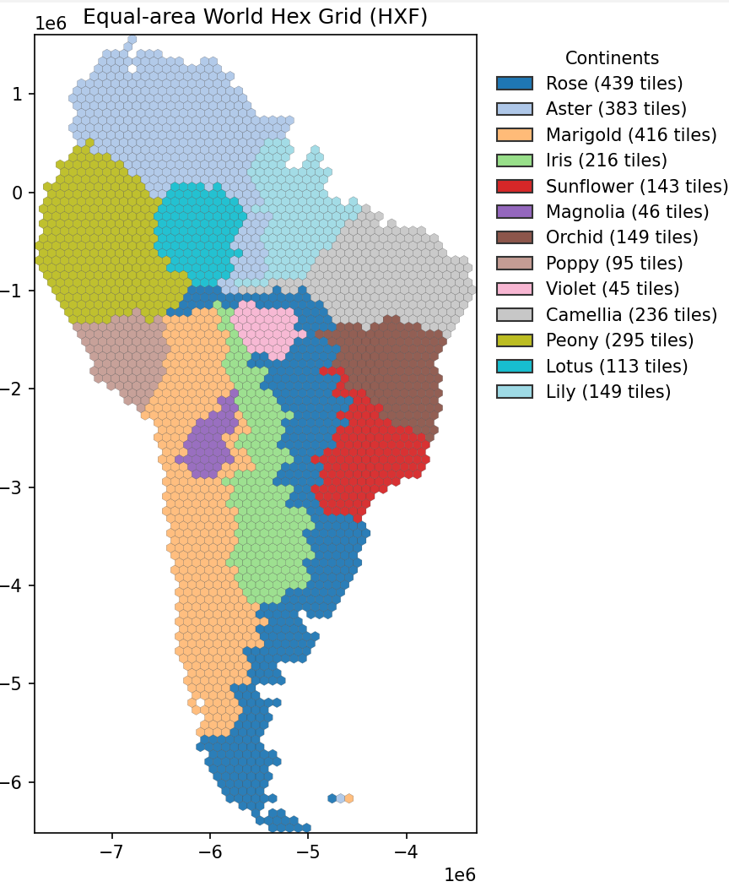
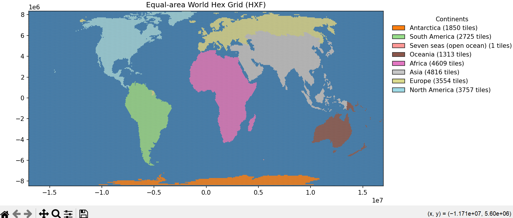

# Hex Series Assignment Project

A minimal pipeline to:
- generate a global hex tiling (HXF format),
- assign labeled "series" to contiguous regions on a continent,
- visualize the results.

Files of interest
- `generate_hexes.py` — create the base hex grid (HXF). Key constants:
  - `DEFAULT_HEX_RADIUS_KM = 250.0` (smaller = more hexes)
  - `WGS84_EPSG = 4326`
  - `EQUAL_EARTH_EPSG = 8857`
  - `NE_LAND_URL` and `NE_ADMIN0_URL` — Natural Earth ZIP download URLs
- `continent_series_regions.py` — grow labeled regions on a chosen continent and write a per-continent HXF.
  - `HXF_PATH` — input HXF (default `outputs/world_hexes_equal_earth.hxf`)
  - `CONTINENT` — continent name (case-insensitive)
  - `OUTPUT_HXF` — output HXF for the continent
  - `RANDOM_SEED`, `DEBUG` — seed and debug prints
  - `DISTRIBUTION` — target global distribution of series (name -> percentage)
- `visualize_hexes.py` — create visual outputs from HXF (set `FILENAME` inside file)

Prerequisites
- Python 3.9+ (https://www.python.org/downloads/)
- Required Python packages: `numpy` and any packages used by the project utilities.
- Internet access only if `generate_hexes.py` must download Natural Earth assets.

Installation
1. Create and activate a virtual environment:
   - Windows (PowerShell):
     - `python -m venv .venv`
     - `.venv\Scripts\Activate.ps1`
2. Install requirements
   - `pip install --upgrade pip`
   - `pip install -r requirements.txt`

Typical workflow
1. Generate hex grid (produces `outputs/world_hexes_equal_earth.hxf`):
   - Edit `DEFAULT_HEX_RADIUS_KM` in `generate_hexes.py` if a different resolution is wanted.
   - Run:
     - `python generate_hexes.py`
   - Output:
     - `outputs/world_hexes_equal_earth.hxf` (used by subsequent scripts)

2. Assign series to a continent:
   - Edit `CONTINENT` and optionally `DISTRIBUTION` and `RANDOM_SEED` in `continent_series_regions.py`.
   - Run:
     - `python continent_series_regions.py`
   - Output:
     - `outputs/<continent>_series_assignment.hxf` (e.g., `outputs/south america_series_assignment.hxf`)
   - Notes:
     - `DISTRIBUTION` is apportioned to match tile counts. To change target shares, modify the dictionary.
     - If `DEBUG = True`, the script prints iterative growth/debug info.

3. Visualize:
   - Edit `FILENAME` in `visualize_hexes.py` to point at the created `.hxf` basename.
   - Run:
     - `python visualize_hexes.py`
   - Output:
     - Visualization files (format depends on the script implementation).

Configuration tips
- Change constants by editing each script near the top. No CLI arguments are currently provided.
- To reproduce results, set `RANDOM_SEED` in `continent_series_regions.py`.
- The pipeline expects `hxf_io` to provide `read_hxf` / `write_hxf` and be available on `PYTHONPATH`.

Output locations
- All generated HXF files are written to the `outputs/` directory by default.

Troubleshooting
- If `read_hxf` / `write_hxf` import fails, ensure the `hxf_io` helper module is on `PYTHONPATH`.
- If no tiles are found for a continent, verify the input HXF (`HXF_PATH`) has `continent_labels` / `continent_codes` metadata.
- For missing system GIS dependencies, inspect `generate_hexes.py` and install required packages (`geopandas`, `shapely`, `pyproj`) as needed.

### Distribution visualizations

- Continent distribution (per-continent series share):

- Global distribution (target vs actual):

